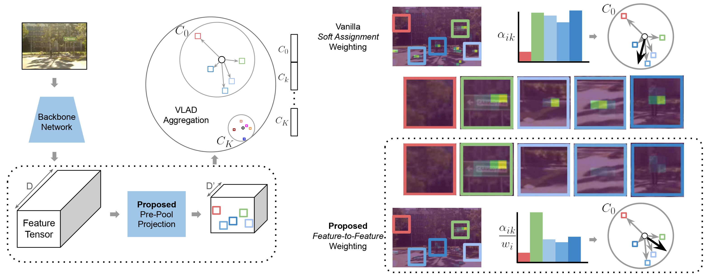

# VLAD-BuFF: Burst-aware Fast Feature Aggregation for Visual Place Recognition (ECCV 2024)
Ahmad Khaliq, Ming Xu, Stephen Hausler, Michael Milford, Sourav Garg

## Summary

This repository provides the implementation of **VLAD-BuFF**, a novel approach to Visual Place Recognition (VPR). VPR plays a crucial role in many visual localization tasks and is often framed as an image retrieval problem. While state-of-the-art methods rely on VLAD aggregation to weigh feature contributions, they face limitations such as the 'burstiness' problem (over-representation of repetitive structures) and the high computational cost of feature-to-cluster comparisons.

VLAD-BuFF addresses these challenges through two key innovations:

- A self-similarity-based feature discounting mechanism that mitigates burstiness by learning burst-aware features during VPR training.
- A fast feature aggregation technique using PCA-initialized, learnable pre-projection to reduce local feature dimensions without sacrificing performance.

Benchmark results on nine public datasets demonstrate that VLAD-BuFF achieves state-of-the-art performance while maintaining high recall, even with significantly reduced feature dimensions. This enables faster aggregation and improved computational efficiency.

For more details, refer to the paper at [arXiv](https://arxiv.org/abs/2409.19293).



## Setup

The code has been tested on PyTorch 2.1.0 with CUDA 12.1 and Xformers. To create a ready-to-run environment, use the following command:
```bash
conda env create -f environment.yml
```
## Trained Models

You can easily load and test our VLAD-BuFF model via Torch Hub with just a few lines of code:

```python
import torch
model = torch.hub.load("Ahmedest61/VLAD-BuFF", "vlad_buff", antiburst=True, nv_pca=192, wpca=True, num_pcs=4096)
model.eval()
model.cuda()
```
## Dataset

For training, download the [GSV-Cities](https://github.com/amaralibey/gsv-cities) dataset. For evaluation download the desired datasets ([MSLS](https://github.com/FrederikWarburg/mapillary_sls), [NordLand](https://surfdrive.surf.nl/files/index.php/s/sbZRXzYe3l0v67W), [SPED](https://surfdrive.surf.nl/files/index.php/s/sbZRXzYe3l0v67W), [Pittsburgh](https://data.ciirc.cvut.cz/public/projects/2015netVLAD/Pittsburgh250k/), [Sfsm](), [Toyko247](https://github.com/gmberton/VPR-datasets-downloader), [StLucia](https://github.com/gmberton/VPR-datasets-downloader), [Baidu](https://github.com/AnyLoc/AnyLoc) and [AmsterTime](https://github.com/gmberton/VPR-datasets-downloader))

## Train

Training is done on GSV-Cities dataset for 4 complete epochs.
To train VLAD-BuFF or 192PrePool VLAD-BuFF, run the following commands:
```bash
python train.py --aggregation NETVLAD --expName dnv2_NV_AB --antiburst --no_wandb

python train.py --aggregation NETVLAD --expName dnv2_NV_192PCA_AB --antiburst  --nv_pca 192 --no_wandb
```

Logs and checkpoints will be saved in the logs directory after training.

## PCA Whitening

To add the PCA whitening layer, use the following commands:

```bash
python add_pca.py --aggregation NETVLAD --expName dnv2_NV_AB --ckpt_state_dict --num_pcs 8192 --resume_train ./logs/lightning_logs/version_0/checkpoints/last.ckpt --antiburst

python add_pca.py --aggregation NETVLAD --expName dnv2_NV_192PCA_AB --ckpt_state_dict --num_pcs 4096 --nv_pca 192 --resume_train ./logs/lightning_logs/version_1/checkpoints/last.ckpt --antiburst
```
## Evaluation

To evaluate the models, run:
```bash
python eval.py --aggregation NETVLAD --wpca --num_pcs 8192 --antiburst --ckpt_state_dict --val_datasets MSLS --expName dnv2_NV_AB --resume_train ./logs/lightning_logs/version_0/checkpoints/dnv2_NV_AB_wpca8192_last.ckpt --store_eval_output --save_dir ./logs/lightning_logs/version_0/ --no_wandb

python eval.py --aggregation NETVLAD --nv_pca 192 --wpca --num_pcs 4096 --antiburst --ckpt_state_dict --val_datasets MSLS --expName dnv2_NV_192PCA_AB --resume_train ./logs/lightning_logs/version_1/checkpoints/dnv2_NV_192PCA_AB_wpca4096_last.ckpt --store_eval_output --save_dir ./logs/lightning_logs/version_1/ --no_wandb
```
You can also download the pretrained VLAD-BuFF models from [here](https://universityofadelaide.app.box.com/s/xykdjfh7wuwvpy9ft58izqeqe30nkvw1).

## Performance on Validation Datasets:

<table>
<thead>
  <tr>
    <th colspan="2">MSLS Val</th>
    <th colspan="2">NordLand</th>
    <th colspan="2">Pitts250k-t</th>
    <th colspan="2">SPED</th>
    <th colspan="2">SFSM</th>
    <th colspan="2">Tokyo247</th>
    <th colspan="2">StLucia</th>
    <th colspan="2">AmsterTime</th>
    <th colspan="2">Baidu</th>
  </tr>
  <tr>
    <th>R@1</th>
    <th>R@5</th>
    <th>R@1</th>
    <th>R@5</th>
    <th>R@1</th>
    <th>R@5</th>
    <th>R@1</th>
    <th>R@5</th>
    <th>R@1</th>
    <th>R@5</th>
    <th>R@1</th>
    <th>R@5</th>
    <th>R@1</th>
    <th>R@5</th>
    <th>R@1</th>
    <th>R@5</th>
    <th>R@1</th>
    <th>R@5</th>
  </tr>
</thead>
<tbody>
  <tr>
    <td>92.4</td>
    <td>95.8</td>
    <td>78.0</td>
    <td>90.4</td>
    <td>95.6</td>
    <td>98.7</td>
    <td>92.8</td>
    <td>96.2</td>
    <td>88.3</td>
    <td>91.0</td>
    <td>96.5</td>
    <td>98.1</td>
    <td>100</td>
    <td>100</td>
    <td>61.7</td>
    <td>81.9</td>
    <td>77.5</td>
    <td>87.9</td>
  </tr>
</tbody>
</table>

<table>
<thead>
  <tr>
    <th colspan="2">MSLS Val</th>
    <th colspan="2">NordLand</th>
    <th colspan="2">Pitts250k-t</th>
    <th colspan="2">SPED</th>
    <th colspan="2">SFSM</th>
    <th colspan="2">Tokyo247</th>
    <th colspan="2">StLucia</th>
    <th colspan="2">AmsterTime</th>
    <th colspan="2">Baidu</th>
  </tr>
  <tr>
    <th>R@1</th>
    <th>R@5</th>
    <th>R@1</th>
    <th>R@5</th>
    <th>R@1</th>
    <th>R@5</th>
    <th>R@1</th>
    <th>R@5</th>
    <th>R@1</th>
    <th>R@5</th>
    <th>R@1</th>
    <th>R@5</th>
    <th>R@1</th>
    <th>R@5</th>
    <th>R@1</th>
    <th>R@5</th>
    <th>R@1</th>
    <th>R@5</th>
  </tr>
</thead>
<tbody>
  <tr>
    <td>91.9</td>
    <td>95.9</td>
    <td>71.4</td>
    <td>86.3</td>
    <td>95.0</td>
    <td>98.2</td>
    <td>90.9</td>
    <td>96.0</td>
    <td>87.3</td>
    <td>90.1</td>
    <td>97.5</td>
    <td>98.4</td>
    <td>99.9</td>
    <td>100</td>
    <td>59.2</td>
    <td>78.7</td>
    <td>74.3</td>
    <td>86.6</td>
  </tr>
</tbody>
</table>

## Analysis

To perform analysis, use the following scripts:

```bash
python predictions.py  --dataset_name MSLS  --your_method_path ./logs/lightning_logs/dnv2_NV_AB/wpca8192_last.ckpt_MSLS_predictions.npz --baseline_paths ./logs/lightning_logs/dnv2_NV_192PCA_AB/wpca8192_last.ckpt_MSLS_predictions.npz 

python cluster_analysis.py  --dataset_name MSLS --method_our dnv2_NV_AB --baseline_name dnv2_NV_192PCA_AB --your_method_path ./logs/lightning_logs/dnv2_NV_AB/wpca8192_last.ckpt_MSLS_predictions.npz --baseline_path ./logs/lightning_logs/dnv2_NV_192PCA_AB/wpca8192_last.ckpt_MSLS_predictions.npz
```

## Cite

If you find our work valuable for your research, please consider citing our paper:

```
@inproceedings{khaliq2024vlad,
  title={Vlad-buff: Burst-aware fast feature aggregation for visual place recognition},
  author={Khaliq, Ahmad and Xu, Ming and Hausler, Stephen and Milford, Michael and Garg, Sourav},
  booktitle={European Conference on Computer Vision. Springer},
  volume={3},
  number={4},
  pages={8},
  year={2024}
}
```

## Acknowledgements

This code is built upon the following work:
 - [AnyLoc](https://github.com/AnyLoc/AnyLoc)
 - [SALAD](https://github.com/serizba/salad)
 - [Deep Visual Geo-localization Benchmark](https://github.com/gmberton/deep-visual-geo-localization-benchmark)
 - [CosPlace](https://github.com/gmberton/CosPlace)
 - [EigenPlaces](https://github.com/gmberton/EigenPlaces)
 - [MixVPR](https://github.com/amaralibey/MixVPR)
 - [GSV-Cities](https://github.com/amaralibey/gsv-cities)
 - [DINOv2](https://github.com/facebookresearch/dinov2)
 - [VPR-methods-evaluation](https://github.com/gmberton/VPR-methods-evaluation)
 - [VPR-datasets-downloader](https://github.com/gmberton/VPR-datasets-downloader)

## Other Related works

 - [Deep Attentional Structured Representation Learning for Visual Recognition](https://arxiv.org/pdf/1805.05389)